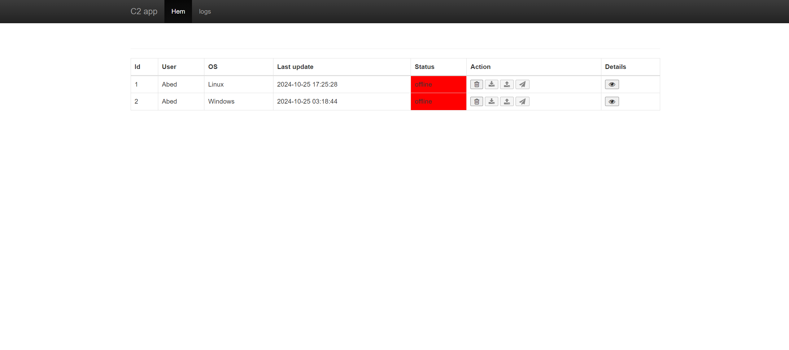

# C2 Security Application

## Introduction
This is a C2 (Command and Control) security application designed for monitoring endpoint devices in a network. The server monitors the client endpoints for suspicious behavior by collecting device information such as:
- OS version and name
- Geolocation (if available)
- Installed applications

The server can also run commands on client machines, transfer files, and receive real-time logs.


## Overview Image


## How to Use

### Prerequisites
Before running the project, make sure you have **Python** installed on your machine. 

- **For Ubuntu/Linux**:
    ```bash
    sudo apt update
    sudo apt install python3
    ```

- **For macOS**:
    ```bash
    brew install python3
    ```

- **For Windows**:  
  Go to the official Python website and download Python: [Download Python](https://www.python.org/downloads/)

  Verify Python installation:
```bash
python3 --version
```
### Clone the repositories

```bash
git clone https://github.com/Abedsandid1997/c2app
```

### Requierments
Once Python is installed, install the dependencies from the requirements.txt file using the following command:
```bash
pip3 install -r requirements.txt
```
### Note
- if it doesn't work on powershell (windows) run this code:
```bash
python3 -m pip install flask-socketio
```

### Build
No specific build steps are required for this project. Just ensure all dependencies are installed using the command above.


### Tests
To run Unittests:
- **Client**:
1. Navigate to the client directory:
```bash
cd client
```
2. Run the test file:
```bash
python3 test.py
```

- **Server**:
1. Navigate to the server directory:
```bash
cd server
```
2. Run the test file:
```bash
python3 test.py
```

## Run the app

- **Start the server**:

1. Navigate to the server directory:
```bash
cd server
```
2. Run the server:
```bash
python3 server.py
```
3. Open a browser and navigate to localhost:5000 to access the server's web interface.

- **Start the client**:

1. Navigate to the client directory:
```bash
cd client
```
2. Run the client:
```bash
python3 client.py
```
3. You will be prompted to choose between:
Running the client in the background.
Running it with a GUI framework (choose based on your preference).


## License

MIT License

Copyright (c) [2024] [Abdelraman Sandid]

Permission is hereby granted, free of charge, to any person obtaining a copy
of this software and associated documentation files (the "Software"), to deal
in the Software without restriction, including without limitation the rights
to use, copy, modify, merge, publish, distribute, sublicense, and/or sell
copies of the Software, and to permit persons to whom the Software is
furnished to do so, subject to the following conditions:

The above copyright notice and this permission notice shall be included in all
copies or substantial portions of the Software.

THE SOFTWARE IS PROVIDED "AS IS", WITHOUT WARRANTY OF ANY KIND, EXPRESS OR
IMPLIED, INCLUDING BUT NOT LIMITED TO THE WARRANTIES OF MERCHANTABILITY,
FITNESS FOR A PARTICULAR PURPOSE AND NONINFRINGEMENT. IN NO EVENT SHALL THE
AUTHORS OR COPYRIGHT HOLDERS BE LIABLE FOR ANY CLAIM, DAMAGES OR OTHER
LIABILITY, WHETHER IN AN ACTION OF CONTRACT, TORT OR OTHERWISE, ARISING FROM,
OUT OF OR IN CONNECTION WITH THE SOFTWARE OR THE USE OR OTHER DEALINGS IN THE
SOFTWARE.